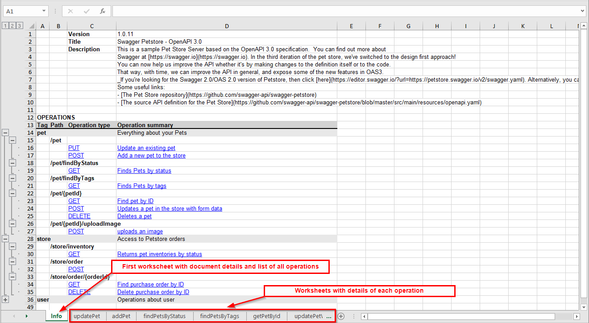
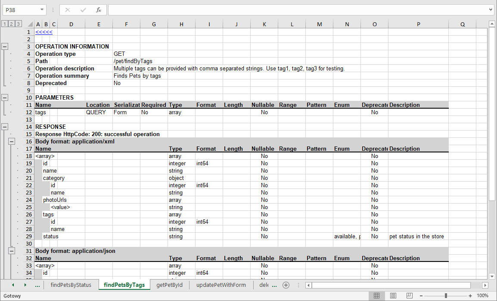

# OpenAPI-2-Excel

<div align="center">
    
</div>

<div align="center">

[](https://github.com/pszybiak/openapi-2-excel)
[](https://dotnet.microsoft.com/en-us/download/dotnet/9.0)
[](https://www.nuget.org/packages/openapi2excel.cli/)
[](https://github.com/pszybiak/openapi-2-excel/blob/main/LICENSE.md)

</div>

Tool to generate a REST API specification in a MS Excel format, a human friendly document built from a Swagger/OpenAPI spec in YAML or JSON. The result should be readable by business analysts and software developers alike.

## Installation

Download and install one of the currently supported [.NET SDKs](https://www.microsoft.com/net/download). Once installed, run the following command:

```bash
dotnet tool install --global openapi2excel.cli
```

Already installed? `dotnet tool update --global openapi2excel.cli`.

## Usage

```text
DESCRIPTION:
Generate Rest API specification in a MS Excel format

USAGE:
    openapi2excel <INPUT_FILE> <OUTPUT_FILE> [OPTIONS]

EXAMPLES:
    openapi2excel C:\openapi.yml C:\openapi.xlsx

ARGUMENTS:
    <INPUT_FILE>     The path or URL to a YAML or JSON file with Rest API specification
    <OUTPUT_FILE>    The path for output excel file

OPTIONS:
    -h, --help           Prints help information
    -v, --version        Prints version information
    -n, --no-logo        Run tool without logo
    -l, --lang           Language of the generated document: a language code or a path to a json file with a translation
    -d, --depth          Maximum depth level for documenting object hierarchies (defaults to 10)
    -g, --debug          Run tool with debug mode
        --no-sanitize    Reject the input file instead of correcting its specification errors
```

The help screen already shows an example. The input of that example is a path to a file, and a URL
the specification is downloaded from works just as well:

```text
  openapi2excel https://petstore3.swagger.io/api/v3/openapi.json C:\openapi-spec.xlsx
```

### Options

| Option | Description |
| --- | --- |
| `-n`, `--no-logo` | Run tool without logo. |
| `-l`, `--lang` | Language of the generated document: a language code (`en`, `pl`) or a path to a json file with a translation. |
| `-d`, `--depth` | Maximum depth level for documenting object hierarchies (defaults to 10). Lower it for specifications with deeply nested or recursive schemas. |
| `-g`, `--debug` | Run tool with debug mode. |
| `--no-sanitize` | Reject the input file instead of correcting its specification errors. |

### The first tab

The first tab describes the api and indexes its operations, grouped the way the specification
groups them: by tag, and inside a tag by path.

| Tag | Path | Operation type: Id | Operation summary |
| --- | --- | --- | --- |
| **pet** | | | Everything about your Pets |
| | **/pet** | | |
| | | PUT: updatePet | Update an existing pet |
| | | POST: addPet | Add a new pet to the store |
| | **/pet/findByStatus** | | |
| | | GET: findPetsByStatus | Finds Pets by status |
| **store** | | | Access to Petstore orders |

- tags come in the order the `tags` section of the document declares them. A tag an operation uses
  but the document never declares follows the declared ones, in the order the operations use it,
- an operation carrying several tags is listed under each of them, the way a reader of the
  specification finds it under each of them,
- operations carrying no tag at all end up in a last group, `Other operations`,
- every group collapses from the header row above it, the way the sections of an operation tab
  already do,
- one column states the type of an operation and the `operationId` the specification names it with,
  `PUT: updatePet`, and that cell and the summary both link to the tab documenting the operation.
  An operation stating no summary is described by the first line of its description, and one
  stating no `operationId` is stated by its type alone: its tab is named after its method and its
  path.

### The last tab

The last tab documents the objects of the specification: every schema the operations name, one
collapsible section each, described by the same table a request or a response body is described
with.

| Name | | Type | Object type | Required | Description |
| --- | --- | --- | --- | --- | --- |
| **Device** | | | | | A device of the network |
| name | | string | | Yes | Name of the device |
| kind | | string | _DeviceKind_ | No | What the device is |
| location | | object | _Location_ | No | |
| | latitude | number | | No | |
| | longitude | number | | No | |
| **DeviceKind** | | | | | What the device is |
| &lt;value&gt; | | string | | No | What the device is |

The names in italics are the links: clicking _Location_ walks to the section describing it.

- an object is a schema the document declares under a name and an operation reaches: the schema of
  a parameter, of a request body, of a response body or of a response header, and every schema
  those reach in turn. A schema written in place has no name to look up and is documented where it
  is used,
- a `$ref` to another document names a schema this one has never read. Such a name is printed and
  is not a link: a schema of the same name declared here is a different schema, and documenting it
  as that one would invent everything it says,
- a schema written as several, `allOf`, is documented as the one schema its parts describe, and the
  alternatives of a `oneOf` or an `anyOf` are documented as one row each, naming and linking to the
  alternative. `Object type` says which of the three it is and what it is written as:
  `All of (Cat, Dog)`, `One of (Cat, Dog)`, `Any of (Cat, Dog)`,
- the `Object type` column links to the section documenting the object it names, from every tab and
  from the sections themselves,
- the body of a request or of a response is an object as often as not, and the table under it only
  names what its properties hold, so the title of a body format says which object the body is and
  links to it: `Body format: application/json (Pet)`. A body holding a list of an object is not
  named after it, the `<array>` row of the table below names what the list holds,
- what the specification says about an object is written next to its name,
- a schema the document declares and no operation reaches is not documented, the tab lists what the
  api actually uses,
- the sections come in alphabetical order, the order a name is looked up in. Each of them collapses
  from the row naming the columns of its table, so the name of an object is never hidden and
  collapsing every section leaves the list of the names,
- an object with no property of its own, an enum or a simple type declared under a name, is
  described by one `<value>` row: its type, its values and its description,
- a specification whose operations name no schema at all gets no such tab,
- the tab links back to the first one, the way the tab of an operation does, and the first tab
  links to it under the index of the operations.

### As a library

The generator is published as `openapi2excel.core` as well, to build the document from your own
application instead of from a command line:

```bash
dotnet add package openapi2excel.core
```

```csharp
await OpenApiDocumentationGenerator.GenerateDocumentation(inputFile, outputFile,
   new OpenApiDocumentationOptions
   {
      Translation = TranslationsSelector.Load("pl").Translation,
      MaxDepth = 5,
      OnDocumentSanitized = report => Console.WriteLine(report.Corrections.Count)
   });
```

The input is a path or a `Stream`, and the options are the ones the command line exposes.

### Container
A container is available, allowing to run the tool without installing extra dependencies. Docker is required to be installed in your system.

Example of building and running local container:
```
# Build the container
docker build -t openapi2excel .

# Run the container, mounting a volume for data persistance
docker run -it -v ./data:/data openapi2excel /data/input.json /data/output.xlsx
```

### Languages

The document is generated in English by default. `pl` is shipped as well:

```text
  openapi2excel C:\openapi-spec.yml C:\openapi-spec.xlsx -l pl
```

A language decides the labels, the names of the first and of the last worksheet, `Yes` and `No`,
and the culture used to format the values taken from the specification, so the same input always
produces the same document whatever culture the machine runs. An unknown language lists what is
available.

To use a language nobody has contributed yet, point `-l` at a json file:

```text
  openapi2excel C:\openapi-spec.yml C:\openapi-spec.xlsx -l ./translations/cs.json
```

Labels the file does not define are taken from English, and the tool prints which ones:

```text
The translation './translations/cs.json' does not define 3 labels, taken from 'en': FieldRange, OperationSummary, ResponseHeaders.
```

#### Adding a language

1. copy [`src/openapi2excel/Lang/en.json`](src/openapi2excel/Lang/en.json) to `<code>.json`, where
   `<code>` is the language code, and translate the values,
2. set `Culture` to the culture whose number and date format the readers of that language expect,
   for example `de-DE`,
3. keep the `{0}` and `{1}` placeholders, they stand for the media type, the http code and the
   response description,
4. drop the file into `src/openapi2excel/Lang/`. It is picked up by the build, no code to change.

`TranslationsTest` then checks that the new file defines every label, defines nothing that does not
exist, names a culture the machine knows, keeps the placeholders, and actually translates something.

### Input file sanitization

Generated specifications often break the OpenAPI standard in ways nobody notices until a strict
reader refuses to open them. By default the tool repairs those documents instead of rejecting
them, prints every correction it made and continues:

```text
The input file does not conform to the OpenAPI specification. Corrected 2 problems:
  - /pet/{pet-id}: DELETE moved to '/pet/{petId}', which has the same signature (parameter 'pet-id' renamed to 'petId')
  - DELETE /store/order/{orderId}: path parameter 'OrderId' renamed to 'orderId' to match the path template
```

The corrections apply to the generated document only, the input file is never modified. Repaired
violations:

- two paths with the same signature, differing only in the name of their parameters. The
  operations of the second path are documented under the first one, unless both paths define the
  same operation, which would lose one of them,
- a path parameter that does not match the path template: it is renamed to the placeholder nobody
  declared, or documented as a query parameter when every placeholder is already declared.

Anything else keeps the document rejected, and `--no-sanitize` restores the strict behaviour for
all of it.

### Referenced type names

A generator that has to add a keyword to a referenced schema, almost always `nullable: true`,
cannot put it next to the `$ref` and wraps the reference in a single element `allOf`:

```yaml
status:
  allOf: [ { $ref: '#/components/schemas/PetStatus' } ]
  nullable: true
```

Such a property is documented with the type, name, format, enum values, default and example of the
schema it references, not as a bare `object`. Whatever the wrapper declares itself wins over the
referenced schema, and `nullable` or `deprecated` counts when either of the two declares it.

A composition of several schemas has no single name, so `Object type` names the schemas it is
written as, and says how they are to be read: `All of (Category, Status)` for an `allOf`,
`One of (Cat, Dog)` for a `oneOf`, `Any of (Cat, Dog)` for an `anyOf`. A composition the document
declares under a name is named by it and links to its section, the way any other named schema does.

## Result

To show how the application works, let's use the official example used on the [Swagger Editor website](https://editor.swagger.io/).

```
  openapi2excel https://raw.githubusercontent.com/swagger-api/swagger-petstore/master/src/main/resources/openapi.yaml C:\openapi.xlsx
```

The first tab is an information tab, presenting document details and the operations of the
document, grouped by tag and by path as described in [The first tab](#the-first-tab).

<div align="center">
    
</div>

The next tabs contain the details of a single operation each.

<div align="center">
    
</div>

The last tab documents the objects those operations use, one collapsible section each, as described
in [The last tab](#the-last-tab). Every name in an `Object type` column walks to the section
describing that object.


## Contribution

If you think the repository can be improved, open a pull request with the improvement, or an issue
to discuss the idea first.

## License

[](https://github.com/pszybiak/openapi-2-excel/blob/main/LICENSE.md)